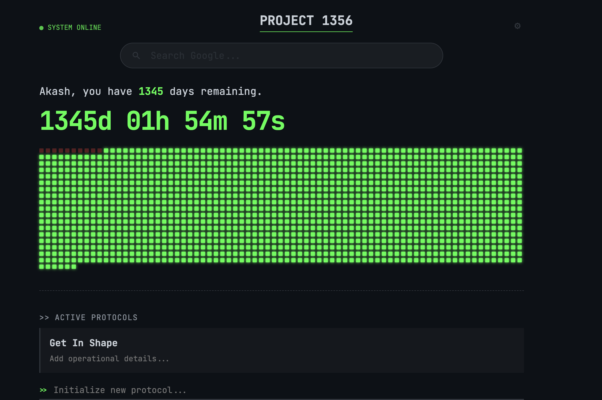

# Project Protocol

> **"Akash, you have 1356 days remaining."**

Inspired by [Project 1356](https://www.instagram.com/project.1356/), **Project Protocol** is a rational, high-contrast dashboard for Google Chrome. It replaces your "New Tab" page with a brutal, honest visualization of time. It is designed for those who need to see the scarcity of time to stay focused on their long-term objectives.



---

## 🚀 Getting Started (Non-Technical Version)

You don't need to be a coder to use this. Just follow these steps:

1.  **Download the Project:**
    * Click the green **"Code"** button at the top of this page.
    * Select **"Download ZIP"**.
2.  **Unzip the Folder:**
    * Find the downloaded file (`project-protocol-main.zip`) and extract/unzip it to a folder on your computer.
3.  **Install in Chrome:**
    * Open Google Chrome and type `chrome://extensions/` in the address bar.
    * In the top-right corner, turn **ON** the switch that says **"Developer mode"**.
    * Click the **"Load unpacked"** button that appears in the top-left.
    * Select the folder you just unzipped.
4.  **Initialize the Protocol:**
    * Open a new tab. You will be asked for your **Codename**, **Start Date**, and **Deadline**.
    * Hit **Initialize** and face the countdown.

---

## 🛠 Developer Installation (CLI Version)

If you have Git installed and want to contribute or tweak the source:

1.  **Clone the Repository:**
    ```bash
    git clone https://github.com/Akash190104/project-protocol.git
    ```
2.  **Load in Chrome:**
    * Navigate to `chrome://extensions/`.
    * Enable **Developer mode**.
    * Click **Load unpacked** and select the cloned directory.

---

## ⚡ Features

* **Visual Scarcity:** A grid of squares representing every day of your project. 🔴 Red = Spent. 🟢 Green = Remaining.
* **Dynamic Naming:** The system calculates the total span and titles the project accordingly (e.g., `PROJECT 1356`).
* **Tactical Protocols:** Add, edit, and terminate high-level goals through a sleek, terminal-style interface.
* **Integrated Search:** A focused Google search bar built directly into the HUD.
* **Privacy:** All data is stored locally in your Chrome Profile using `chrome.storage.sync`. No external servers.

---

## ⚙️ How to Reset

If you reach your goal early or want to change your deadline:
* Click the **Gear Icon (⚙)** in the top-right corner of the dashboard to reset the system initialization.
